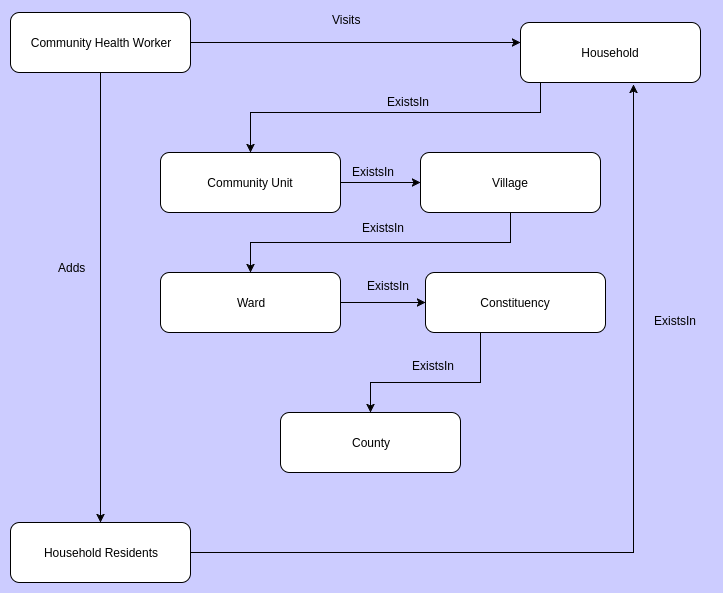
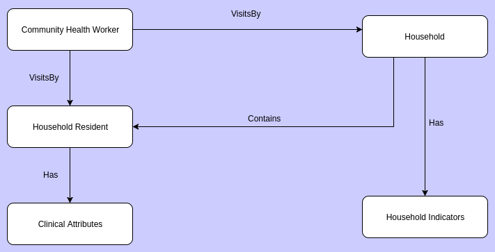

#####################
Community Module
#####################

********************
Overview
********************

Community Health Work
----------------------
Access to a health provider is something that is commonly taken for granted.
From a kenyan perspective, the doctor to patient ratio is approximately 2:10000, implying that there are chances you may not get to see one in your lifetime!.

Community Health workers come in to change that.

A community health worker is trained to provide the most essential life saving interventions such as emergency care. They also equip families with knowledge and skills to prevent diseases. They Promote sanitation, hygiene, and good nutrition. 

*****************
The Module
*****************

The community module is primarily meant for recording household visits/episodes that are done by Community Health Workers.  To achieve this, the following distinct activities are defined:

Module Architecture
-------------------

**Class Diagram**

Below is a simplified class diagram of the module workflow:

*Registration*

Once a Community Health Worker visits a house, household registration takes place first since residents must be assigned to a house as they are registered.
During house registration, a house number is provided, so as to uniquely identify the house.
The location of the house is also specified such as the community unity, village, ward, constituency, and the county from which the house exists.
The household residents are added, starting with the **head** of the family.

Below is a class diagram that elaborates this process:

*Visit*

Once a household and its residents exist in the system, a visit is done. A visit can be done either by a person or by a household. A visit by a person details are stored in a different table from a visit by a household since both processes are unique. The diagram below explains further the processes:

Household registration
-----------------------
A household refers to a house and its occupants.
Unique households are defined during a household mapping activity. These details are captured into the com_household table and implemented through HouseholdController in StoneHMIS
com_household table.

The com_household table contains :

+----------------------------+-------------+----------+----------+----------+------+
|           Column           | Type        | Null     | Default  | Comments | MIME | 
+============================+=============+==========+==========+==========+======+
| com_household_id           |    int(11)  |  No      |          |          |      |
+----------------------------+-------------+----------+----------+----------+------+
| household_number           | varchar(255)|  No      |          |          |      |
+----------------------------+-------------+----------+----------+----------+------+
| com_unit_id                | bigint(20)  |  No      |          |          |      |
+----------------------------+-------------+----------+----------+----------+------+
| com_user_id                | bigint(20)  |  No      |          |          |      |
+----------------------------+-------------+----------+----------+----------+------+
| county_of_household        | varchar(50) |  No      |          |          |      |
+----------------------------+-------------+----------+----------+----------+------+
| constituency_of_household  | varchar(50) |  Yes     |    Null  |          |      |
+----------------------------+-------------+----------+----------+----------+------+
| ward_of_household          | varchar(255)|  No      |          |          |      |
+----------------------------+-------------+----------+----------+----------+------+
| village_of_household       | varchar(255)|  No      |          |          |      |
+----------------------------+-------------+----------+----------+----------+------+
| household_latitude         | bigint(10,6)|  Yes     |    Null  |          |      |
+----------------------------+-------------+----------+----------+----------+------+
| household_longitude        | bigint(10,6)|  Yes     |    Null  |          |      |
+----------------------------+-------------+----------+----------+----------+------+
| date_registered            | int(20)     |  Yes     |    Null  |          |      |
+----------------------------+-------------+----------+----------+----------+------+
| registering_user_id        | int(20)     |  Yes     |    Null  |          |      |
+----------------------------+-------------+----------+----------+----------+------+
| registering_user_id        | int(20)     |  Yes     |    Null  |          |      |
+----------------------------+-------------+----------+----------+----------+------+

Household Residents Registration
---------------------------------
These are the occupants of the house.
A house must have residents for community health work to be done. 
To avoid running parallel systems, I.e community module running parallel to stoneHMIS, household residents are registered during the normal registration in stone,(in the registry module). However, the household residents details go into a different table called com_household_residence, which is linked to the reg_person table through reg_person_id. 
 
.. note::

   The residents are registered starting with the head of the household, so that the subsequent occupants are assigned that head. 

The com_household_residence table contains : 

+----------------------------+------------+----------+----------+----------+------+
|           Column           | Type       | Null     | Default  | Comments | MIME | 
+============================+============+==========+==========+==========+======+
| com_household_residence_id | bigint(20) |  No      |          |          |      |
+----------------------------+------------+----------+----------+----------+------+
| reg_person_id              | bigint(20) |  No      |          |          |      |
+----------------------------+------------+----------+----------+----------+------+
| household_number           | bigint(20) |  No      |          |          |      |
+----------------------------+------------+----------+----------+----------+------+
| date_registered            | 	date      |  No      |          |          |      |
+----------------------------+------------+----------+----------+----------+------+
| is_household_head          | int(20)    |  No      |          |          |      |
+----------------------------+------------+----------+----------+----------+------+
| date_created               | timestamp  |  Yes     |    Null  |          |      |
+----------------------------+------------+----------+----------+----------+------+
| reg_episode_id             | bigint(20) |  No      |          |          |      |
+----------------------------+------------+----------+----------+----------+------+
| person_code                | bigint(20) |  No      |          |          |      |
+----------------------------+------------+----------+----------+----------+------+
| altering_user_id           | 	int(20)   |  Yes     |    Null  |          |      |
+----------------------------+------------+----------+----------+----------+------+
| registering_user_id        | int(20)    |  Yes     |    Null  |          |      |
+----------------------------+------------+----------+----------+----------+------+

**Indexes**

+---------+------+--------+--------+----------------------------+--------------+-----------+------+---------+
| Keyname | Type | Unique | Packed |    Column                  |  Cardinality | Collation | Null | Comment | 
+=========+======+========+========+============================+==============+===========+======+=========+
| PRIMARY | BTREE| Yes    | No     | com_household_residence_id |  4           |   A       |   No |         |
+---------+------+--------+--------+----------------------------+--------------+-----------+------+---------+

**heeey**

